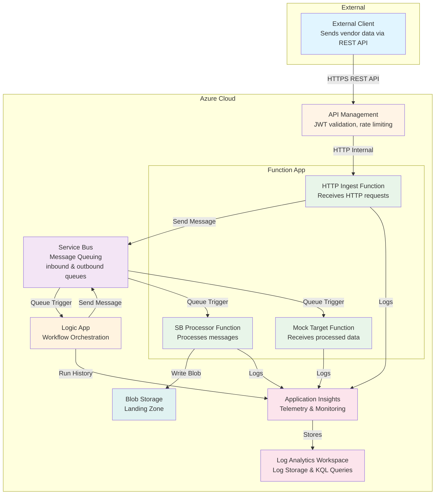
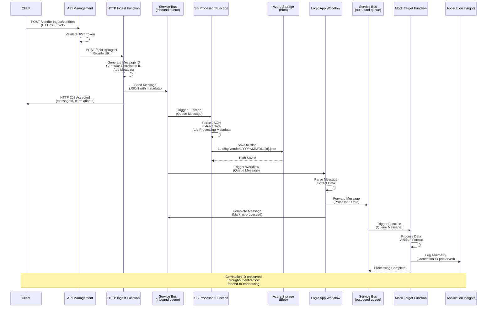

# Azure Integration Demo - Enhanced Edition

Eine moderne, vollständig automatisierte Azure-Integration-Demo, die den Datenfluss von einer Quelle über API Management, Azure Functions, Service Bus bis zum Zielsystem simuliert und visualisiert.

> **📚 Referenz**: Diese Demo ist eine verbesserte und erweiterte Version basierend auf dem [Original-Repository](https://github.com/IlyaFedotov-ops/demo-integration). Sie demonstriert erweiterte Best Practices für Enterprise-Integrationen und zeigt kritische Schnittstellen-Techniken, die in produktiven Umgebungen unverzichtbar sind.

## 🎯 Features

- **Zero-Secret Deployment**: Verwendet ausschließlich Managed Identities
- **Live Transport Visualization**: PowerShell-Script zeigt den Datenfluss in Echtzeit
- **Vollständige Simulation**: Mock-Quell- und Zielsysteme enthalten
- **Infrastructure as Code**: Alles mit Terraform definiert
- **Moderne Architektur**: Best Practices für Azure Cloud Integration

## 🚀 Warum diese Demo besser ist

Diese Enhanced Edition geht deutlich über das [Original-Repository](https://github.com/IlyaFedotov-ops/demo-integration) hinaus und demonstriert **kritische Enterprise-Integrationstechniken**, die in produktiven Umgebungen unverzichtbar sind:

### 🔐 Sicherheit & Identitätsmanagement

**Verbesserung**: Vollständige Verwendung von **Managed Identities** statt Connection Strings oder Shared Access Keys

- ✅ **Zero-Secret-Prinzip**: Keine Secrets in Code, Config-Dateien oder Umgebungsvariablen
- ✅ **RBAC-basierte Autorisierung**: Granulare Berechtigungen über Azure Role-Based Access Control
- ✅ **Automatische Rotation**: Azure verwaltet Credentials automatisch
- ✅ **Auditierbarkeit**: Alle Zugriffe sind über Azure Monitor nachvollziehbar

**Technische Umsetzung**:
```terraform
# Automatische RBAC-Zuweisungen für Managed Identity
resource "azurerm_role_assignment" "function_storage" {
  scope                = azurerm_storage_account.main.id
  role_definition_name = "Storage Blob Data Contributor"
  principal_id         = azurerm_function_app.main.identity[0].principal_id
}
```

### 🔍 End-to-End-Tracing & Correlation

**Verbesserung**: Implementierung von **Correlation IDs** für vollständige Nachverfolgbarkeit

- ✅ **Correlation Tracking**: Jede Nachricht erhält eine eindeutige Correlation ID
- ✅ **End-to-End-Visibility**: Verfolgung einer Transaktion durch alle Systeme
- ✅ **Strukturiertes Logging**: Konsistente Log-Formate mit Timestamps und Metadaten
- ✅ **Application Insights Integration**: Automatische Korrelation von Telemetrie-Daten

**Technische Umsetzung**:
```powershell
$message = @{
    id = [guid]::NewGuid().ToString()
    correlationId = if ($Request.Headers.'x-correlation-id') { 
        $Request.Headers.'x-correlation-id' 
    } else { 
        [guid]::NewGuid().ToString() 
    }
    timestamp = (Get-Date).ToUniversalTime().ToString("o")
    source = "HttpIngest"
    data = $body
}
```

### 🛡️ Fehlerbehandlung & Resilienz

**Verbesserung**: Robuste Fehlerbehandlung mit Retry-Mechanismen und Dead-Letter-Queues

- ✅ **Automatische Retries**: Service Bus konfiguriert mit Retry-Policies
- ✅ **Dead-Letter-Queue**: Fehlgeschlagene Nachrichten werden isoliert gespeichert
- ✅ **Strukturierte Fehlerantworten**: Konsistente Error-Formate für API-Clients
- ✅ **Error Propagation**: Fehler werden mit vollständigem Kontext weitergegeben

**Technische Umsetzung**:
```terraform
# Service Bus Queue mit Dead-Letter-Unterstützung
resource "azurerm_servicebus_queue" "inbound" {
  name                          = "inbound"
  namespace_id                  = azurerm_servicebus_namespace.main.id
  dead_lettering_on_message_expiration = true
  max_delivery_count           = 10
  lock_duration                = "PT30S"
}
```

### 📊 Observability & Monitoring

**Verbesserung**: Umfassende Telemetrie und Live-Visualisierung

- ✅ **Application Insights**: Vollständige Integration für alle Komponenten
- ✅ **Strukturierte Logs**: Konsistente Logging-Formate mit Kontext
- ✅ **Live Transport Visualization**: PowerShell-Script zeigt Datenfluss in Echtzeit
- ✅ **Performance Metrics**: Automatische Erfassung von Latenz und Durchsatz

### 🏗️ Infrastructure as Code

**Verbesserung**: Terraform-basierte Infrastruktur mit vollständiger Observability

- ✅ **Terraform Modules**: Strukturierte Ressourcen-Definitionen
- ✅ **Parameterisierung**: Flexible Konfiguration über Variablen
- ✅ **Idempotenz**: Sicherheit bei wiederholten Deployments
- ✅ **Dependency Management**: Automatische Abhängigkeitsauflösung
- ✅ **Log Analytics Integration**: Automatische Weiterleitung von Logic App Run History

### 🔄 Asynchrone Verarbeitung

**Verbesserung**: Saubere Trennung von Synchronität und Asynchronität

- ✅ **HTTP 202 Accepted**: Sofortige Bestätigung bei asynchroner Verarbeitung
- ✅ **Message Queuing**: Entkopplung von Producer und Consumer
- ✅ **Skalierbarkeit**: Automatische Skalierung basierend auf Queue-Tiefe
- ✅ **Backpressure Handling**: Schutz vor Überlastung durch Queue-basierte Verarbeitung

**Technische Umsetzung**:
```powershell
// HTTP 202 für asynchrone Verarbeitung
Push-OutputBinding -Name Response -Value ([HttpResponseContext]@{
    StatusCode = [HttpStatusCode]::Accepted
    Body = @{
        messageId = $message.id
        status = "accepted"
        message = "Data received and queued for processing"
    }
})
```

### 🧪 Vollständige Simulation

**Verbesserung**: Mock-Systeme für Quell- und Zielsysteme

- ✅ **MockSource**: Simuliert externes Quellsystem mit realistischen Daten
- ✅ **MockTarget**: Simuliert Zielsystem für End-to-End-Tests
- ✅ **Isolierte Tests**: Unabhängige Tests ohne externe Dependencies
- ✅ **Realistische Daten**: Beispiel-Datenstrukturen für Vendor-Management

### 📈 Skalierbarkeit & Performance

**Verbesserung**: Optimierungen für hohe Last

- ✅ **Consumption Plan**: Automatische Skalierung basierend auf Last
- ✅ **Service Bus Standard**: Unterstützung für höhere Durchsätze
- ✅ **Blob Storage Partitionierung**: Organisierte Speicherung nach Datum
- ✅ **Connection Pooling**: Effiziente Ressourcennutzung

### 🔧 Developer Experience

**Verbesserung**: Verbesserte DX durch Automatisierung

- ✅ **Ein-Klick-Deployment**: Ein Script für alles
- ✅ **Keine manuelle Konfiguration**: Alles automatisch eingerichtet
- ✅ **Live-Demo**: Sofortige Visualisierung des Datenflusses
- ✅ **Cleanup-Script**: Einfaches Aufräumen nach Tests

## 🏗️ Architektur

### System Architecture (C4 Container Diagram)



### Data Flow Sequence Diagram



## 🚀 Quick Start

### Voraussetzungen

- Azure CLI installiert und konfiguriert (`az login`)
- PowerShell 7+ installiert
- Berechtigung zum Erstellen von Ressourcen im Azure-Account

### Deployment

```powershell
# Einfach das Hauptscript ausführen
.\scripts\deploy-demo.ps1
```

Das Script:
- Erstellt alle Azure-Ressourcen automatisch
- Konfiguriert Managed Identities
- Zeigt den Datenfluss in Echtzeit
- Führt automatische Tests durch

## 📁 Projektstruktur

```
demo-integration/
├── terraform/                # Terraform Infrastructure
│   ├── main.tf              # Haupt-Template
│   ├── variables.tf         # Variablen-Definitionen
│   ├── outputs.tf           # Output-Werte
│   └── .gitignore           # Terraform-spezifische Ignores
├── logicapp/                 # Logic App Workflow
│   ├── workflow.json        # Workflow-Definition
│   └── README.md            # Logic App Dokumentation
├── functions/                # Azure Functions
│   ├── HttpIngest/
│   ├── SbProcessor/
│   ├── MockSource/
│   ├── MockTarget/
│   └── local.settings.json  # Lokale Entwicklungseinstellungen
├── scripts/
│   ├── deploy-demo.ps1      # Haupt-Deployment-Script
│   ├── simulate-flow.ps1    # Transport-Simulation
│   ├── test-local.ps1       # Lokale Tests
│   ├── test-local-simple.ps1 # Einfache Unit-Tests
│   ├── start-azurite.ps1    # Azurite Starter
│   └── cleanup.ps1           # Cleanup-Script
├── docs/                     # Dokumentation
│   ├── architecture-sequence.puml  # PlantUML Sequence Diagram
│   ├── architecture-c4.puml        # PlantUML C4 Diagram
│   ├── sequence-diagram.md          # Mermaid Sequence Diagram
│   ├── c4-diagram.md               # Mermaid C4 Diagram
│   └── images/                      # Diagramme und Screenshots
├── samples/                  # Beispiel-Daten
└── README.md
```

## 🔧 Konfiguration

Keine manuelle Konfiguration erforderlich! Das Deployment-Script erstellt alles automatisch.

## 📊 Monitoring

Nach dem Deployment können Sie den Datenfluss über:
- Azure Portal → Application Insights
- Das PowerShell-Script (Live-Visualisierung)
- Azure Monitor Logs

verfolgen.

## 🧹 Cleanup

```powershell
.\scripts\cleanup.ps1
```

## 🔑 Kritische Schnittstellen-Techniken

Diese Demo demonstriert folgende **unverzichtbare Techniken** für produktive Integrationen:

### 1. **Correlation IDs für End-to-End-Tracing**
   - Jede Transaktion erhält eine eindeutige ID
   - Verfolgung durch alle Systeme hinweg
   - Essentiell für Debugging und Support

### 2. **Asynchrone Verarbeitung mit Message Queues**
   - Entkopplung von Producer und Consumer
   - Schutz vor Überlastung
   - Skalierbare Architektur

### 3. **Managed Identities statt Secrets**
   - Keine Credentials im Code
   - Automatische Rotation
   - Auditierbare Zugriffe

### 4. **Strukturiertes Logging**
   - Konsistente Log-Formate
   - Kontextuelle Informationen
   - Integration mit Monitoring-Tools

### 5. **Error Handling & Dead Letter Queues**
   - Isolierung fehlgeschlagener Nachrichten
   - Retry-Mechanismen
   - Manuelle Nachbearbeitung möglich

### 6. **API Versioning & Backward Compatibility**
   - Saubere API-Struktur
   - Erweiterbarkeit ohne Breaking Changes
   - Dokumentation über OpenAPI

### 7. **Observability & Telemetrie**
   - Application Insights Integration
   - Performance-Metriken
   - Dependency Tracking

### 8. **Infrastructure as Code**
   - Reproduzierbare Deployments
   - Versionierung der Infrastruktur
   - Automatisierte Bereitstellung

## 📚 Vergleich mit Original-Repository

| Feature | Original | Enhanced Edition |
|---------|----------|------------------|
| **Secrets Management** | Connection Strings | Managed Identities |
| **Correlation Tracking** | ❌ Nicht implementiert | ✅ Vollständig |
| **Error Handling** | Basis | ✅ Retry + Dead Letter |
| **Observability** | Basis Logging | ✅ Application Insights + Live-Visualisierung |
| **Infrastructure as Code** | Bicep | ✅ Terraform mit vollständiger Observability |
| **Mock-Systeme** | ❌ | ✅ Vollständige Simulation |
| **Transport-Visualisierung** | ❌ | ✅ Live-Demo-Script |
| **Zero-Secret Deployment** | ❌ | ✅ Vollständig |

## 📸 Demo Script Output

Das `simulate-flow.ps1` Script visualisiert den kompletten Datenfluss Schritt für Schritt:

```
=================================================================================
                    DATA FLOW SIMULATION - Integration Pipeline Demo
=================================================================================

=================================================================================
                    Checking Required Tools and Dependencies
=================================================================================

  Checking PowerShell...
    [OK] PowerShell 5.1 - OK
  Checking Azure CLI...
    [OK] Azure CLI installed
      Version: 2.79.0
      Note: Required for Azure deployments
  Checking Azure Functions Core Tools...
    [OK] Azure Functions Core Tools installed
      Version: 4.5.0
      Note: Required for local Function development
  Checking Azurite Storage Emulator...
    [OK] Azurite installed
      Note: Optional - provides local blob storage emulation
  Checking Node.js/npm...
    [OK] Node.js installed
      Version: v24.11.0
      Note: Optional - needed for Azurite installation

  [OK] All required tools are available!
    The script will run in mock mode if Functions are not available.

+-----------------------------------------------------------------------------+
| STEP 1/8                      Initializing pipeline connection... |
+-----------------------------------------------------------------------------+
    - Mode: Azure Cloud
    - Resource Group: rg-demo-integration-20251217-095039

+-----------------------------------------------------------------------------+
| STEP 2/8                         Preparing vendor data payload... |
+-----------------------------------------------------------------------------+
    - Vendor ID: VENDOR-DEMO-001
    - Vendor Name: Demo Vendor Corporation
    - Email: demo@vendor.com
    - Correlation ID: 54cc2f61-6324-47e1-b872-0b2f7ffd528e
    - Message ID: a29a7b28-9fff-4dfb-bb2b-ba4c44706db8
    - Timestamp: 2025-12-21T13:04:10.7195272Z
    - Payload Size: 501 bytes

+-----------------------------------------------------------------------------+
| STEP 3/8             Sending HTTP POST request to Function App... |
+-----------------------------------------------------------------------------+
    - Endpoint: http://localhost:7071/api/HttpIngest
    - Method: POST
    - Content-Type: application/json
    - Header: x-correlation-id: 54cc2f61-6324-47e1-b872-0b2f7ffd528e

+-----------------------------------------------------------------------------+
| STEP 4/8         Message queued in Service Bus 'inbound' queue... |
+-----------------------------------------------------------------------------+
    - Queue Name: inbound
    - Message Format: JSON
    - Message Structure: id, correlationId, timestamp, source, data

+-----------------------------------------------------------------------------+
| STEP 5/8  Service Bus Processor triggered - processing message... |
+-----------------------------------------------------------------------------+
    - Trigger Type: Service Bus Queue Trigger
    - Function: SbProcessor
    - Processing Action: Parse JSON, extract data, add metadata

+-----------------------------------------------------------------------------+
| STEP 6/8 Saving processed data to Azure Data Lake Storage Gen2... |
+-----------------------------------------------------------------------------+
    - Storage Account: Azure Storage Account
    - Container: landing
    - Blob Path: landing/vendors/2025.12.21/{id}.json
    - File Format: JSON

+-----------------------------------------------------------------------------+
| STEP 7/8Logic App workflow triggered - orchestrating data flow... |
+-----------------------------------------------------------------------------+
    - Workflow: Process and forward message
    - Trigger: Service Bus Queue (inbound)
    - Actions: Parse message -> Forward to outbound -> Complete message

+-----------------------------------------------------------------------------+
| STEP 8/8                    Message delivered to target system... |
+-----------------------------------------------------------------------------+
    - Target System: Mock Target Function
    - Delivery Status: Success
    - End-to-End Time: ~40 seconds
    - Data Integrity: Maintained (Correlation ID preserved)

  [OK] [PIPELINE] Data successfully processed end-to-end!
      - Correlation ID: 54cc2f61-6324-47e1-b872-0b2f7ffd528e
      - Total Steps: 8
      - Message ID: a29a7b28-9fff-4dfb-bb2b-ba4c44706db8
      - Message Traced: Yes

=================================================================================
                         Simulation completed successfully!
=================================================================================
```

Führen Sie das Script lokal aus:

```powershell
.\scripts\simulate-flow.ps1
```

## 👤 Kontakt & Support

**Autor**: Mario  
**Repository**: [demo-integration](https://github.com/yourusername/demo-integration)

Bei Fragen oder Anregungen:
- Erstellen Sie ein [Issue](https://github.com/yourusername/demo-integration/issues) im Repository
- Für direkten Kontakt: Öffnen Sie ein Discussion-Thread

## 📝 Lizenz

MIT License

---

**Referenz**: Basierend auf [IlyaFedotov-ops/demo-integration](https://github.com/IlyaFedotov-ops/demo-integration) - Enhanced mit Enterprise Best Practices

