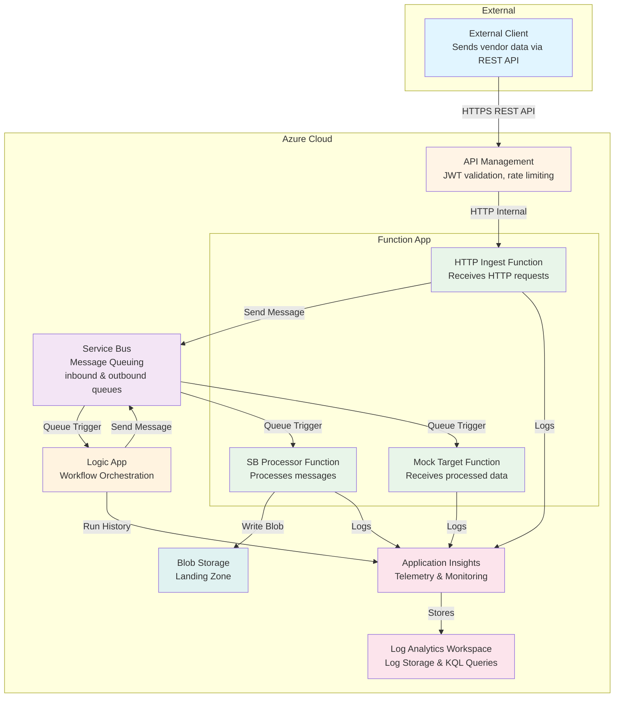

# C4 Container Diagram - System Architecture

```mermaid
graph TB
    subgraph "External"
        Client[External Client<br/>Sends vendor data via REST API]
    end
    
    subgraph "Azure Cloud"
        APIM[API Management<br/>JWT validation, rate limiting]
        
        subgraph "Function App"
            HttpIngest[HTTP Ingest Function<br/>Receives HTTP requests]
            SBProcessor[SB Processor Function<br/>Processes messages]
            MockTarget[Mock Target Function<br/>Receives processed data]
        end
        
        ServiceBus[Service Bus<br/>Message Queuing<br/>inbound & outbound queues]
        LogicApp[Logic App<br/>Workflow Orchestration]
        Storage[Blob Storage<br/>Landing Zone]
        AppInsights[Application Insights<br/>Telemetry & Monitoring]
        LogAnalytics[Log Analytics Workspace<br/>Log Storage & KQL Queries]
    end
    
    Client -->|HTTPS REST API| APIM
    APIM -->|HTTP Internal| HttpIngest
    HttpIngest -->|Send Message| ServiceBus
    ServiceBus -->|Queue Trigger| SBProcessor
    ServiceBus -->|Queue Trigger| LogicApp
    SBProcessor -->|Write Blob| Storage
    LogicApp -->|Send Message| ServiceBus
    ServiceBus -->|Queue Trigger| MockTarget
    HttpIngest -->|Logs| AppInsights
    SBProcessor -->|Logs| AppInsights
    MockTarget -->|Logs| AppInsights
    LogicApp -->|Run History| AppInsights
    AppInsights -->|Stores| LogAnalytics
    
    style Client fill:#e1f5ff
    style APIM fill:#fff4e6
    style HttpIngest fill:#e8f5e9
    style SBProcessor fill:#e8f5e9
    style MockTarget fill:#e8f5e9
    style ServiceBus fill:#f3e5f5
    style LogicApp fill:#fff3e0
    style Storage fill:#e0f2f1
    style AppInsights fill:#fce4ec
    style LogAnalytics fill:#fce4ec
```

