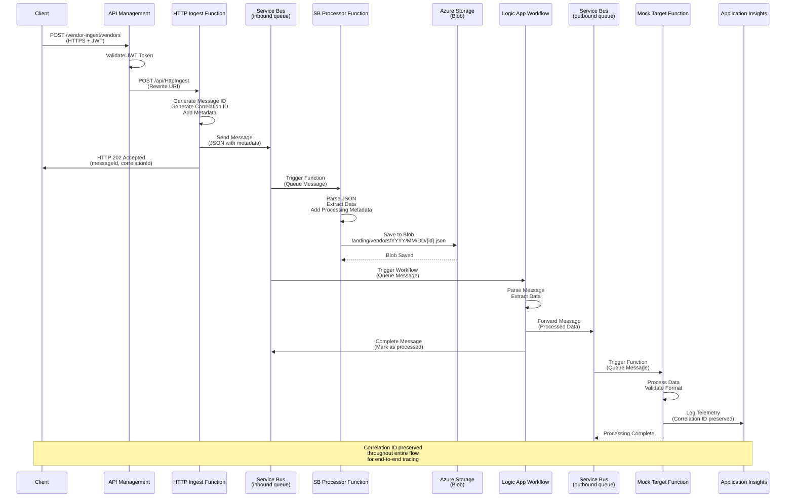

# Sequence Diagram - Data Flow

```mermaid
sequenceDiagram
    participant Client
    participant APIM as API Management
    participant HttpIngest as HTTP Ingest Function
    participant SBInbound as Service Bus<br/>(inbound queue)
    participant SBProcessor as SB Processor Function
    participant Storage as Azure Storage<br/>(Blob)
    participant LogicApp as Logic App Workflow
    participant SBOutbound as Service Bus<br/>(outbound queue)
    participant MockTarget as Mock Target Function
    participant AppInsights as Application Insights

    Client->>APIM: POST /vendor-ingest/vendors<br/>(HTTPS + JWT)
    APIM->>APIM: Validate JWT Token
    APIM->>HttpIngest: POST /api/HttpIngest<br/>(Rewrite URI)
    
    HttpIngest->>HttpIngest: Generate Message ID<br/>Generate Correlation ID<br/>Add Metadata
    HttpIngest->>SBInbound: Send Message<br/>(JSON with metadata)
    HttpIngest->>Client: HTTP 202 Accepted<br/>(messageId, correlationId)
    
    SBInbound->>SBProcessor: Trigger Function<br/>(Queue Message)
    SBProcessor->>SBProcessor: Parse JSON<br/>Extract Data<br/>Add Processing Metadata
    SBProcessor->>Storage: Save to Blob<br/>landing/vendors/YYYY/MM/DD/{id}.json
    Storage-->>SBProcessor: Blob Saved
    
    SBInbound->>LogicApp: Trigger Workflow<br/>(Queue Message)
    LogicApp->>LogicApp: Parse Message<br/>Extract Data
    LogicApp->>SBOutbound: Forward Message<br/>(Processed Data)
    LogicApp->>SBInbound: Complete Message<br/>(Mark as processed)
    
    SBOutbound->>MockTarget: Trigger Function<br/>(Queue Message)
    MockTarget->>MockTarget: Process Data<br/>Validate Format
    MockTarget->>AppInsights: Log Telemetry<br/>(Correlation ID preserved)
    MockTarget-->>SBOutbound: Processing Complete
    
    Note over Client,AppInsights: Correlation ID preserved<br/>throughout entire flow<br/>for end-to-end tracing
```

